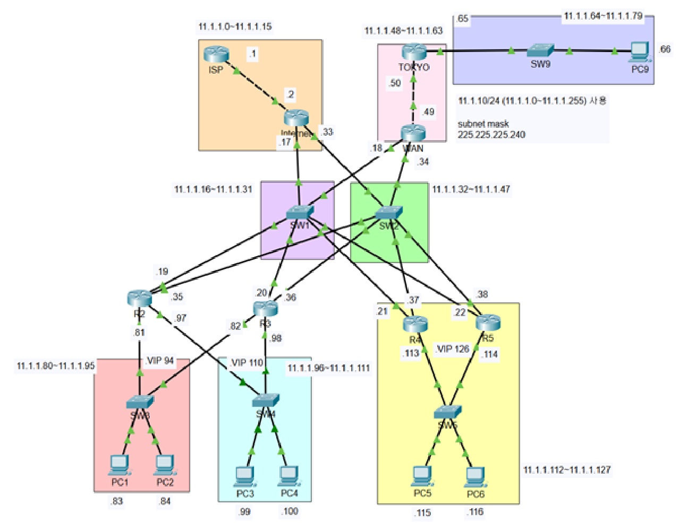

# 🌐 Building an Enterprise Network with VLSM, EIGRP, and HSRP

> Cisco Packet Tracer를 이용하여 Enterprise 네트워크를 설계하고 VLSM, EIGRP, HSRP를 구현한 실습입니다.


---

## 📖 Overview

본 실습에서는 중소규모 Enterprise 네트워크를 가정하여 다음 기술들을 하나의 토폴로지에 통합하였습니다.

- VLSM (Variable Length Subnet Mask)
- EIGRP Dynamic Routing
- HSRP Gateway Redundancy
- Hierarchical Network Design
- Multi-Router Topology

---

## 🎯 Objectives

- Design an Enterprise Network
- Configure VLSM Addressing
- Configure EIGRP Routing
- Implement HSRP Redundancy
- Verify End-to-End Connectivity

---

## 🗺️ Network Topology

> topology/topology.jpg

<p align="center">

</p>

---

## 🛠️ Technologies

| Technology | Description |
|------------|-------------|
| VLSM | Efficient IP Address Allocation |
| EIGRP | Dynamic Routing Protocol |
| HSRP | Gateway Redundancy |
| Cisco Packet Tracer | Network Simulation |

---

## 📂 Project Structure

```text
Building-an-Enterprise-Network-with-VLSM-EIGRP-and-HSRP
│
├── README.md
├── packet-tracer/
│   └── LAB103.pkt
│
├── topology/
│   └── topology.png
│
├── configs/
│   ├── ISP.txt
│   ├── Internet.txt
│   ├── R2.txt
│   ├── R3.txt
│   ├── R4.txt
│   ├── R5.txt
│   ├── WAN.txt
│   └── TOKYO.txt
│
└── images/
```

---

## 🧠 What I Learned

✔ Enterprise Network Design

✔ VLSM Subnetting

✔ EIGRP Neighbor Formation

✔ HSRP Gateway Redundancy

✔ Multi-Router Routing

✔ Network Verification

---

## 🔍 Verification

```text
show ip route
show ip eigrp neighbors
show ip protocols
show standby brief
show ip interface brief

ping
traceroute
```

---

## 📚 Lab Environment

| Item | Value |
|------|-------|
| Simulator | Cisco Packet Tracer |
| Routing | EIGRP |
| Gateway Redundancy | HSRP |
| Addressing | VLSM |

---

## 🚀 Future Improvements

- OSPF Version
- VRRP (Real Device)
- EtherChannel
- ACL
- NAT
- IPv6