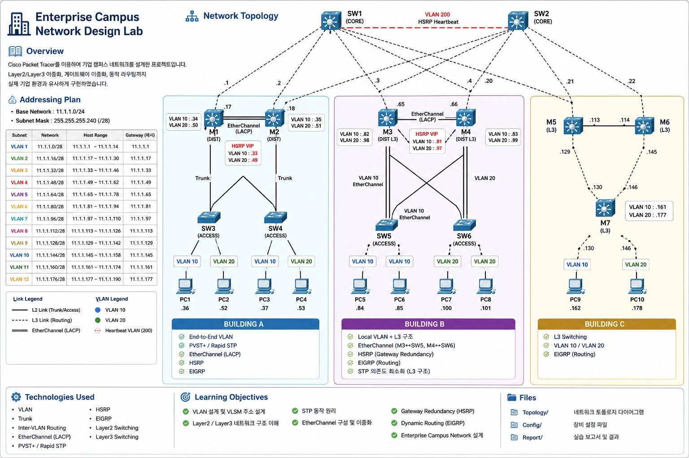

# Enterprise Campus Network Design Lab



## Overview

Enterprise Campus Network를 Cisco Packet Tracer로 설계한 프로젝트입니다.

실제 기업망을 참고하여 Layer2와 Layer3 네트워크를 함께 구성하였으며, VLAN, STP, EtherChannel, HSRP, EIGRP 등의 기술을 적용하였습니다.

---

## Objectives

- Enterprise Campus Network 설계
- VLAN 설계 및 운용
- Gateway 이중화
- Link 이중화
- Dynamic Routing
- Layer2 / Layer3 비교

---

## Topology

| Building | Architecture |
|----------|--------------|
| A | End-to-End VLAN |
| B | Local VLAN |
| C | Layer3 Switching |

---

## Technologies

- VLAN
- Trunk
- Inter-VLAN Routing
- EtherChannel (LACP)
- PVST+
- Rapid PVST+
- HSRP
- EIGRP
- Layer2 Switching
- Layer3 Switching

---

## Folder Structure

```
Topology/
Building-A/
Building-B/
Building-C/
Docs/
Images/
```

---

## Skills

- Cisco IOS
- Enterprise Campus Design
- Network Redundancy
- High Availability
- Routing
- Switching
- VLSM

---

## Author

GitHub Portfolio Project