# Building A Verification

## Overview

본 문서는 Building A의 네트워크 구성이 정상적으로 동작하는지 검증한 결과를 기록합니다.

---

# Test Environment

| Device | Description |
|---------|-------------|
| M1 | Distribution Switch |
| M2 | Distribution Switch |
| SW3 | Access Switch |
| SW4 | Access Switch |
| PC1 | VLAN 10 Client |
| PC2 | VLAN 20 Client |
| PC3 | VLAN 10 Client |
| PC4 | VLAN 20 Client |

---

# Verification 1 - VLAN Connectivity

## 목적

동일 VLAN 간 통신이 가능한지 확인한다.

### Test

```
PC1> ping 11.1.1.37
```

### Result

Success Rate : 100%

### Screenshot

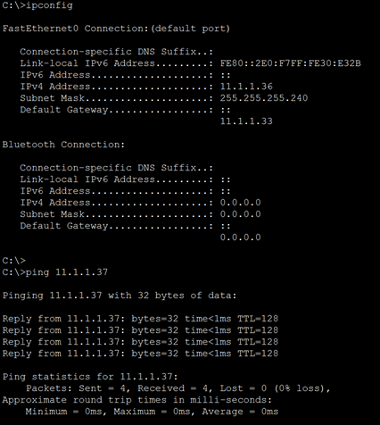

---

## 목적

동일 VLAN(VLAN20) 간 통신 확인

### Test

```
PC2> ping 11.1.1.53
```

### Result

Success Rate : 100%

### Screenshot

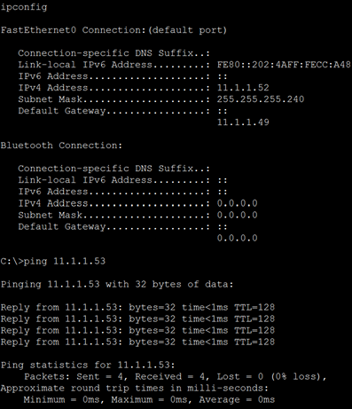

---

# Verification 2 - Inter-VLAN Routing

## 목적

Gateway를 통한 VLAN 간 Routing 확인

### Test

```
PC1> ping 11.1.1.53
```

### Result

Routing Success

### Screenshot

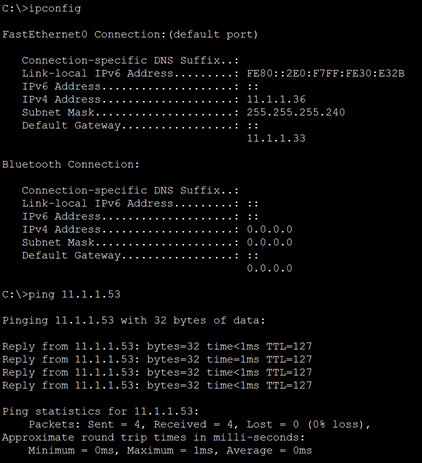

---

# Verification 3 - Trunk Verification

## Command

```
show interfaces trunk
```

### Expected Result

- VLAN 10 허용
- VLAN 20 허용
- Trunk Port 정상

### Screenshot

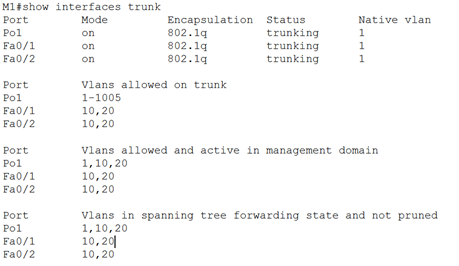

---

# Verification 4 - EtherChannel

## Command

```
show etherchannel summary
```

### Expected Result

```
Po1(SU)
```

- Port-channel Up
- LACP 정상 동작

### Screenshot

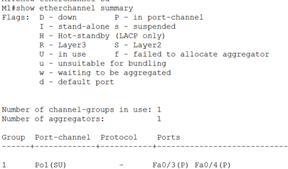

---

# Verification 5 - STP

## Command

```
show spanning-tree vlan 10
```

### 확인 내용

- Root Bridge 확인
- Root Port 확인
- 모든 Access Port Forwarding 상태

### Screenshot

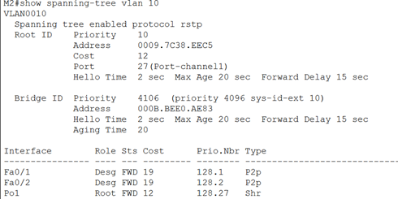

---

# Verification 6 - HSRP

## Command

```
show standby brief
```

### 확인 내용

- Active Router
- Standby Router
- Virtual IP
- Priority

### Screenshot

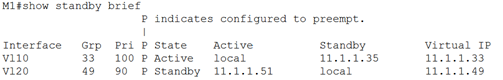

---

# Verification 7 - EIGRP Neighbor

## Command

```
show ip eigrp neighbors
```

### 확인 내용

- Neighbor 형성
- Hold Timer 정상
- Uptime 확인

### Screenshot

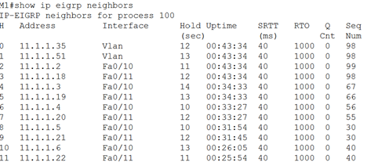

---

# Verification 8 - Routing Table

## Command

```
show ip route
```

### 확인 내용

```
D
```

EIGRP Route 학습 여부 확인

### Screenshot

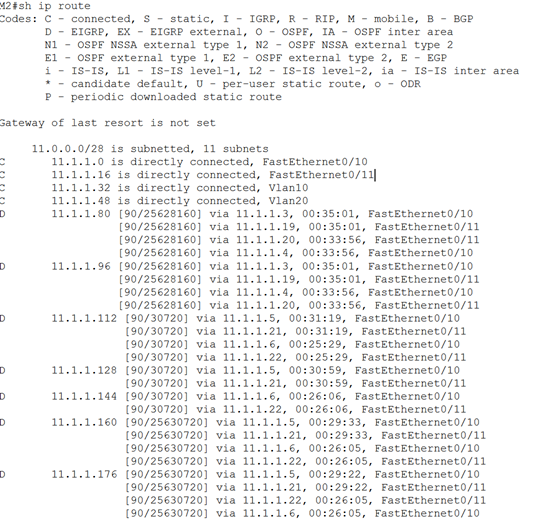

---

# Verification 9 - End-to-End Connectivity

## 목적

Building A에서 Building C까지 통신 확인

### Test

```
PC1> ping 11.1.1.162
```

### Result

Success Rate : 100%

### Screenshot

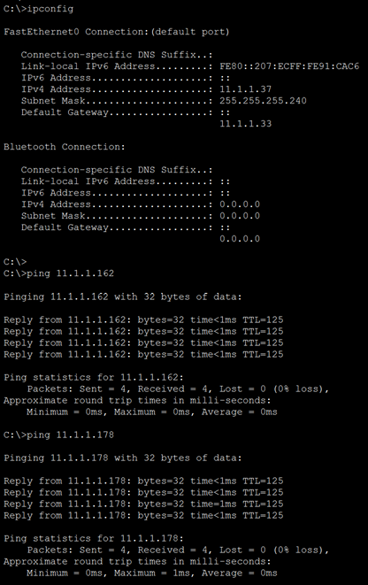

---

# Verification 10 - Traceroute

## 목적

패킷이 예상한 경로로 전달되는지 확인

### Test

```
PC1> tracert 11.1.1.162
```

### Expected Path

```
PC1
 ↓
SW3
 ↓
M1
 ↓
SW1
 ↓
SW2
 ↓
M7
 ↓
PC9
```

### Screenshot

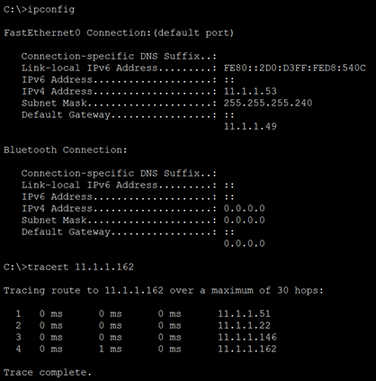

---

# Test Summary

| Test Item | Result |
|------------|--------|
| VLAN 10 Connectivity | ✅ Pass |
| VLAN 20 Connectivity | ✅ Pass |
| Inter-VLAN Routing | ✅ Pass |
| Trunk | ✅ Pass |
| EtherChannel | ✅ Pass |
| STP | ✅ Pass |
| HSRP | ✅ Pass |
| EIGRP Neighbor | ✅ Pass |
| Routing Table | ✅ Pass |
| End-to-End Ping | ✅ Pass |
| Traceroute | ✅ Pass |

# Verification 11 - HSRP Failover

## 목적

Active Router 장애 발생 시 Standby Router가 Active로 승격되는지 확인한다.

### 절차

1. M1의 VLAN 10 인터페이스 Shutdown
2. `show standby brief` 실행
3. PC1에서 Gateway 및 원격 PC로 Ping 테스트

### 기대 결과

- M2가 Active Router로 전환
- Virtual IP 유지
- Ping 손실은 1~2회 이내

### Screenshot

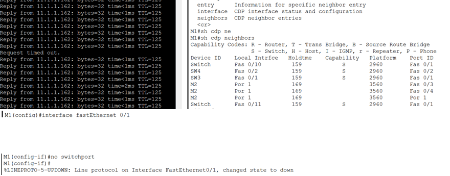
---

# Conclusion

Building A는 설계한 요구사항에 따라 정상적으로 동작하였다.

- VLAN 통신 정상
- Inter-VLAN Routing 정상
- EtherChannel 정상
- STP Loop Prevention 정상
- HSRP Gateway Redundancy 정상
- EIGRP Neighbor 정상
- End-to-End Connectivity 정상