# 🖧 OSI 계층별 대표 장비

---

# 1계층 (Physical Layer)

<p align="center">
    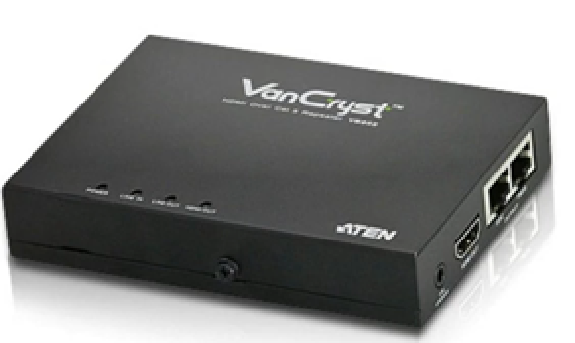
    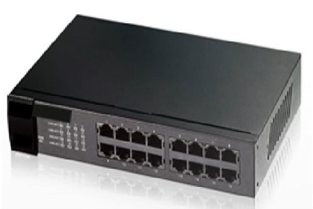
    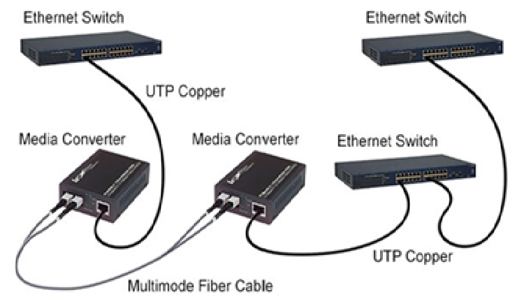
    
</p>

### 대표 장비
- Hub
-- Cable 전송으로 약화된 신호를 초기화, 증폭, 재전송의 기능을 수행
-- 리피터는 상위 계층에서 사용하는 MAC주소나 IP 주소를 이해하지 못하고 단지 전기 신호만을 증폭시키는 역할을 한다.
-- 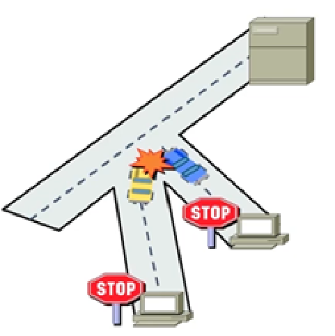
--- 모든 장비에 데이터 프레임을 전송하여 충돌이 많이 발생, 허브에 연결된 장비들은 하나의 Collision domain 형성
- Repeater
-- 리피터와 마찬가지로 전기적 신호를 증폭
-- LAN 전송거리를 연장시키고 여러 대 장비를 LAN에 접속 할 수 있도록 한다. (멀티포트 리피터)
- Media Converter
-- Media Converter는 **서로 다른 전송 매체(Media)를 변환하는 장비**이다.
-- 가장 일반적으로는 **UTP(RJ-45) ↔ 광케이블(Fiber)** 사이의 신호를 변환하여 장거리 통신이 가능하도록 한다.
-- OSI **1계층(Physical Layer)** 에서 동작하며, 데이터 내용을 해석하지 않고 **전기 신호와 광 신호만 변환**한다.
-- 전기 신호 ↔ 광 신호 변환
-- UTP ↔ Fiber 변환
-- 장거리 통신 지원
-- 기존 구리 케이블 네트워크를 광 네트워크와 연결

### 특징
- Bit 전송
- 전기 신호 전달
- 광 신호 전달

### 참고사이트
- https://www.lightoptics.co.uk/blogs/news/what-is-the-fiber-media-converter
- https://www.fibermall.com/ko/blog/layer-2-switch.htm?srsltid=AfmBOorI7n3Z7WxvwWZziuAtsdoSYc8LPeRPbGegpEX8ufUKCRpL2E_r
---

# 2계층 (Data Link Layer)

<p align="center">
    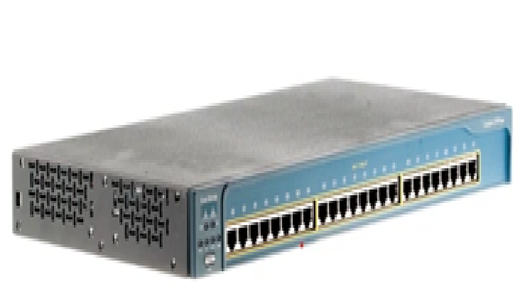
    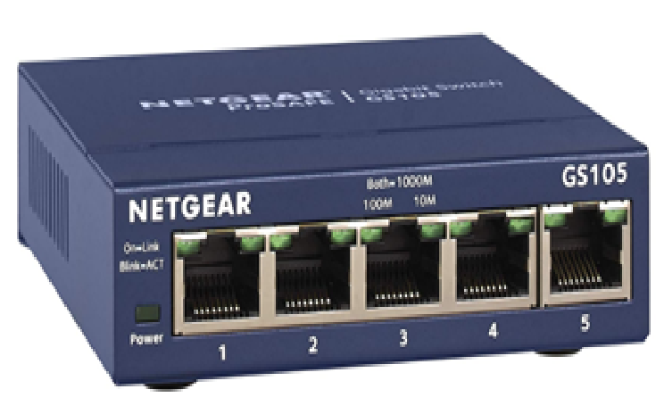
    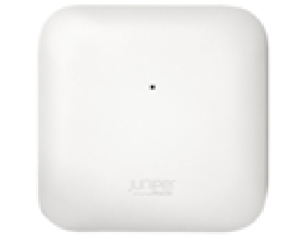
</p>

### 대표 장비
### L2 Switch

- MAC Address Table(CAM Table)을 학습하여 목적지 포트로만 Frame을 전송
- 필요한 포트에만 Frame을 전달하므로 불필요한 트래픽이 감소
- 각 포트는 **독립적인 Collision Domain**을 형성
- 일반적으로 ASIC(Application Specific Integrated Circuit)을 이용한 **하드웨어 기반 스위칭**으로 매우 빠른 처리 속도를 제공
- VLAN, STP, Port Security 등의 기능 지원

> **시험 포인트**
>
> - Collision Domain : 포트마다 1개
> - Broadcast Domain : VLAN마다 1개

---

### Bridge

- 둘 이상의 LAN을 연결하는 2계층 장비
- MAC Address를 학습하여 필요한 포트로만 Frame을 전달
- 소프트웨어 기반으로 동작하여 L2 Switch보다 처리 속도가 느림
- 현대에는 대부분 L2 Switch가 Bridge 기능을 대체

> **시험 포인트**
>
> - Bridge = Software
> - L2 Switch = Hardware(ASIC)

---

### Wireless AP (Access Point)

- 무선 LAN과 유선 LAN을 연결하는 장비
- 무선 단말(노트북, 스마트폰)의 Frame을 유선 네트워크로 전달
- 일반적으로 브리지(Bridge) 기능을 수행하는 2계층 장비
- 기업용 AP는 VLAN, SSID, 보안(802.1X, WPA2/WPA3) 등을 지원

---

## 대표 프로토콜

- Ethernet (IEEE 802.3)
- Wi-Fi (IEEE 802.11)
- STP / RSTP / MSTP
- VLAN (IEEE 802.1Q)

---

## 핵심 용어

| 용어 | 설명 |
|------|------|
| PDU | Frame |
| 주소 | MAC Address |
| 장비 | L2 Switch, Bridge, Wireless AP |
| Collision Domain | Switch 포트마다 1개 |
| Broadcast Domain | VLAN마다 1개 |

---

## 한 줄 암기

> **"2계층은 MAC 주소를 이용하여 Frame을 전달하며, 대표 장비는 L2 Switch, Bridge, Wireless AP이다."**

### 특징
- **MAC 주소**를 이용하여 Frame을 전달
- **Frame 단위**로 데이터 전송
- 오류 검출(CRC)
- VLAN, STP 등의 기능 제공

### 참고사이트
- https://discussion.scottibyte.com/t/what-is-a-bridge/193
- https://buy.hpe.com/kr/ko/networking/juniper-solutions/juniper-switching-solutions/juniper-ap47-high-performance-access-point/p/1014919978
---

# 3계층 (Network Layer)

<p align="center">
    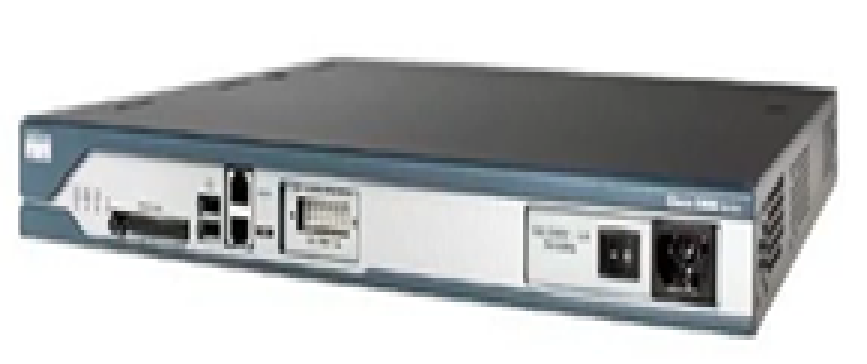
    
</p>

### 대표 장비
- Router / L3 Switch
-- IP주소 등 Layer 3 Header에 있는 주소를 참조하여 목적지와 연결되는 포트로 packet을 전송
-- 다른 네트워크(LAN) 구간의 장비와 통신을 하려면 반드시 Layer 3 장비를 거쳐야 함
-- 특정 인터페이스를 통하여 수신한 packet의 목적지 IP 주소를 보고 목적지와 연결된 인터페이스를 통하여 전송할 것을 결정, Routing이라고 함
-- 최적의 경로 선택
-- 멀티캐스트, 브로드캐스트, 목적지를 모르는 유니캐스트를 수신할 경우 모두 차단

### 특징
- IP Routing
- 경로 선택

---

# 여러 가지 통신 케이블 
# 100BASE-T (Fast Ethernet)

## 개요

**100BASE-T**는 IEEE 802.3u 표준의 **Fast Ethernet(고속 이더넷)** 기술이다.

기존 10Mbps Ethernet(10BASE-T)보다 10배 빠른 **100Mbps 전송 속도**를 제공한다.

---

## 명칭 의미

| 구분 | 의미 |
|------|------|
| 100 | 전송 속도 **100Mbps** |
| BASE | Baseband 방식 (기저대역 전송) |
| T | Twisted Pair Cable (UTP/STP 케이블) |

> **100BASE-T = 100Mbps 속도의 UTP 기반 Ethernet**

---

# 종류

| 종류 | 케이블 | 최대 거리 | 특징 |
|------|--------|-----------|------|
| 100BASE-TX | Cat5 UTP/STP | 100m | 가장 많이 사용 |
| 100BASE-T4 | Cat3 UTP | 100m | 4Pair 사용, 현재 거의 사용 안 함 |
| 100BASE-FX | 광케이블 | 약 2km | Fiber 기반 |

---

# 100BASE-TX 특징

## 케이블

- Cat5 이상 UTP 케이블 사용
- RJ-45 커넥터 사용
- 최대 거리: 100m

## Pair 사용

100BASE-TX는 UTP 4Pair 중 **2Pair 사용**

| Pair | 용도 |
|------|------|
| 1,2번 Pair | 송신(TX) |
| 3,6번 Pair | 수신(RX) |

---

# 전송 방식

| 항목 | 내용 |
|------|------|
| 속도 | 100Mbps |
| 전송 방식 | Baseband |
| 통신 방식 | CSMA/CD (Half Duplex 환경) |
| Duplex | Half / Full Duplex 지원 |
| 표준 | IEEE 802.3u |

---

# OSI 계층

100BASE-T는 **Physical Layer(1계층)** 기술이다.

- Bit 단위 전송
- 전기 신호 변환
- 케이블 규격 정의

---

# Ethernet 발전 과정

| 기술 | 속도 | 케이블 |
|------|------|--------|
| 10BASE-T | 10Mbps | Cat3 UTP |
| 100BASE-TX | 100Mbps | Cat5 UTP |
| 1000BASE-T | 1Gbps | Cat5e UTP |
| 10GBASE-T | 10Gbps | Cat6/Cat6A |

---

# 실무 포인트

- 현재 대부분의 네트워크는 **1000BASE-T(Gigabit Ethernet)** 이상으로 대체됨
- 오래된 장비, 산업용 장비, 일부 CCTV 장비에서 100BASE-T 사용
- Auto Negotiation을 통해 10/100Mbps 속도 자동 협상 가능

---

# 암기

```
10BASE-T
  ↓ 10배 증가
100BASE-T (Fast Ethernet)
  ↓ 10배 증가
1000BASE-T (Gigabit Ethernet)
```

> **100BASE-T = IEEE 802.3u / 100Mbps / UTP / Fast Ethernet**

---

# 케이블의 종류
- UTP/STP (랜케이블)
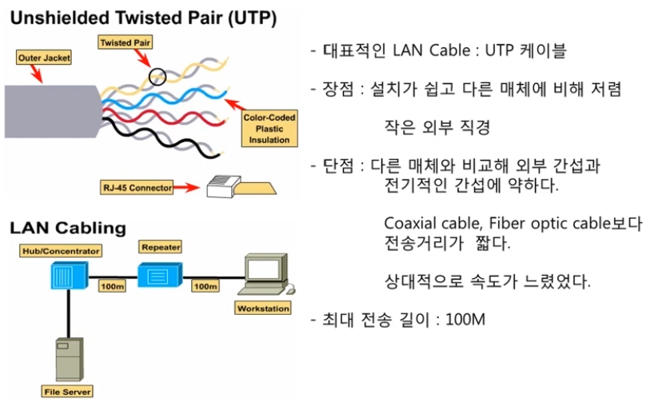
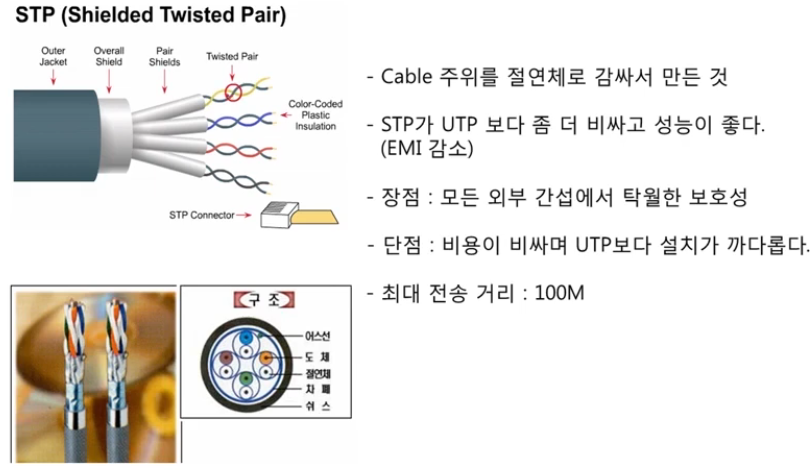
- Coaxial(동축케이블)
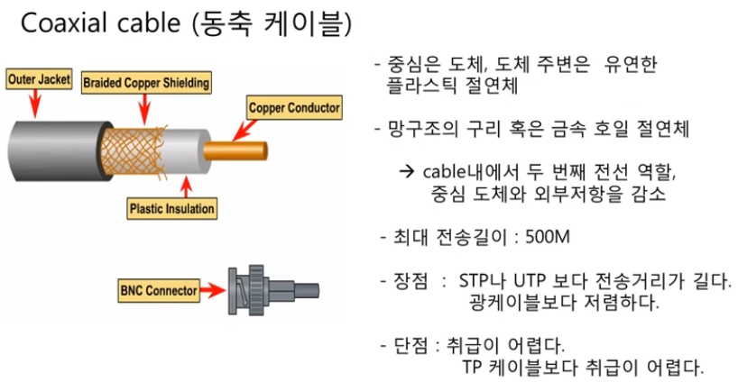
- Fiber-Optic(광케이블)
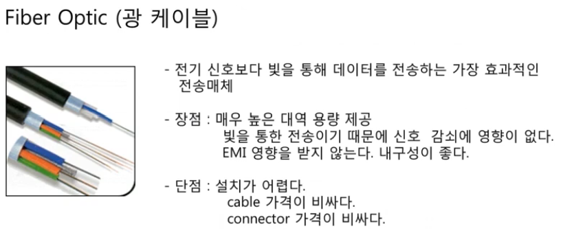

---

# Cable 추가 내용
> 참고사이트 : https://www.youtube.com/watch?v=6w3x1B1KJYw

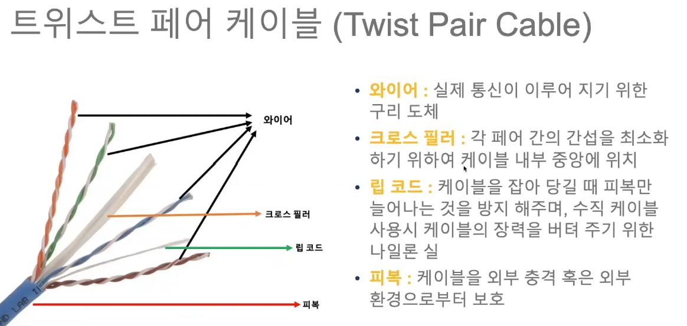

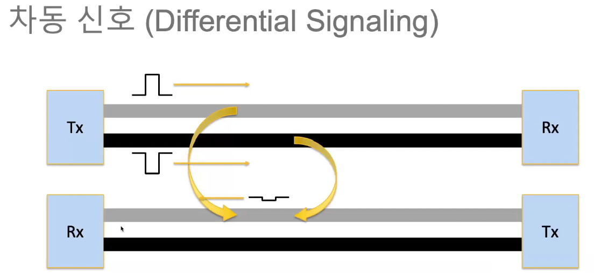
-- 차동신호를 통해 누하(Crosstalk)를 줄임
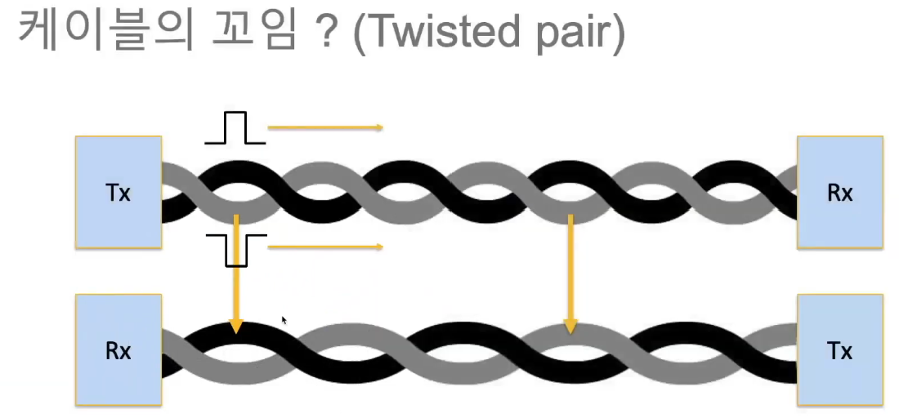
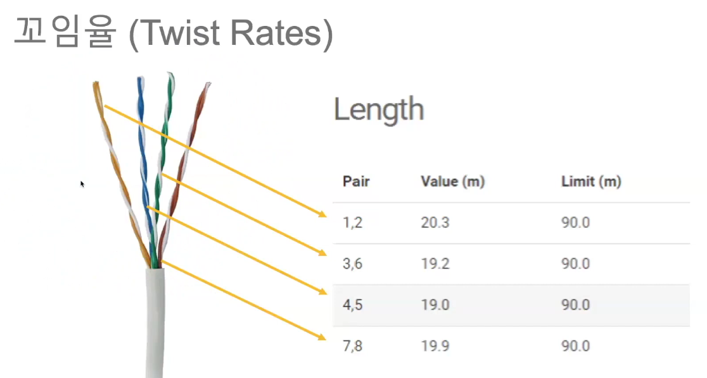
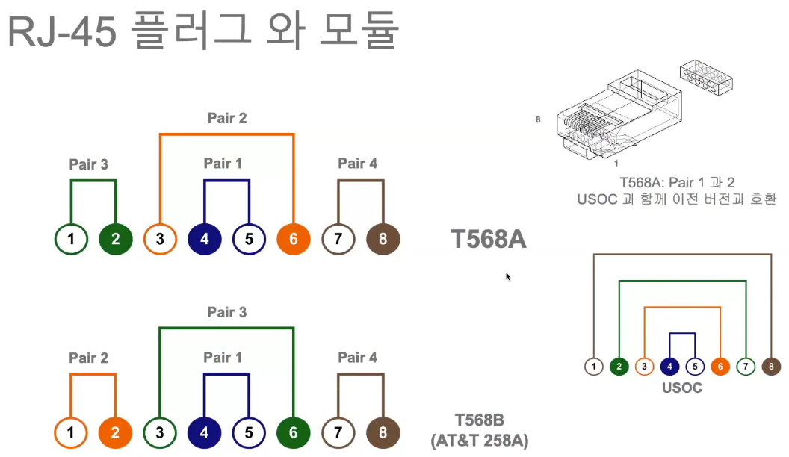
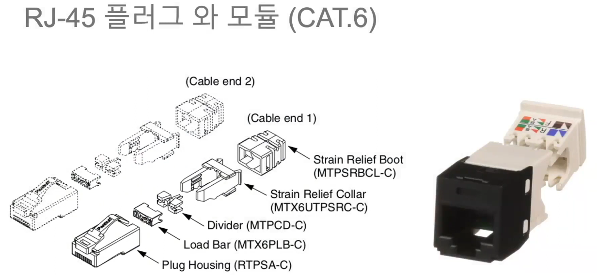
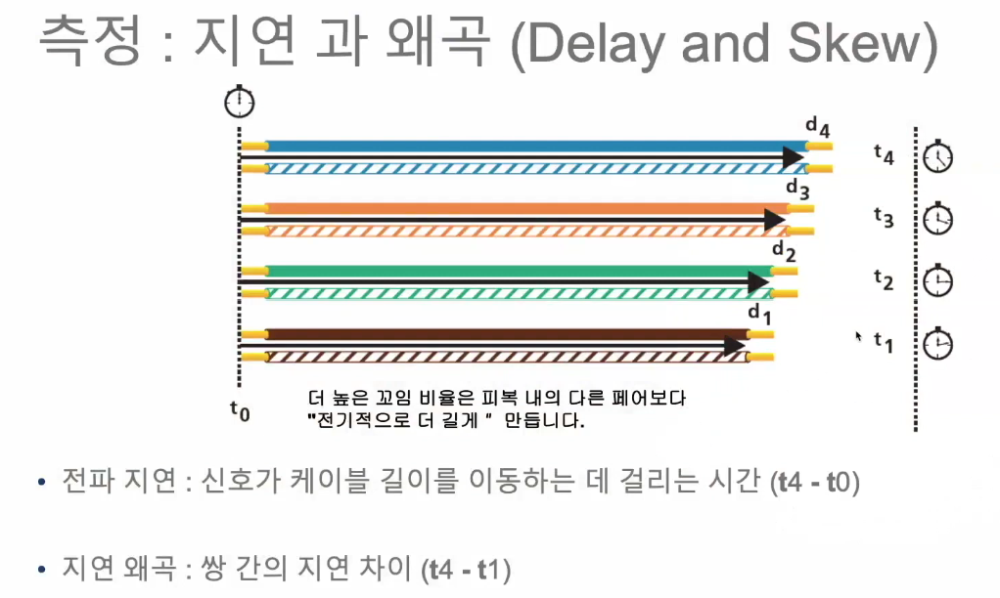
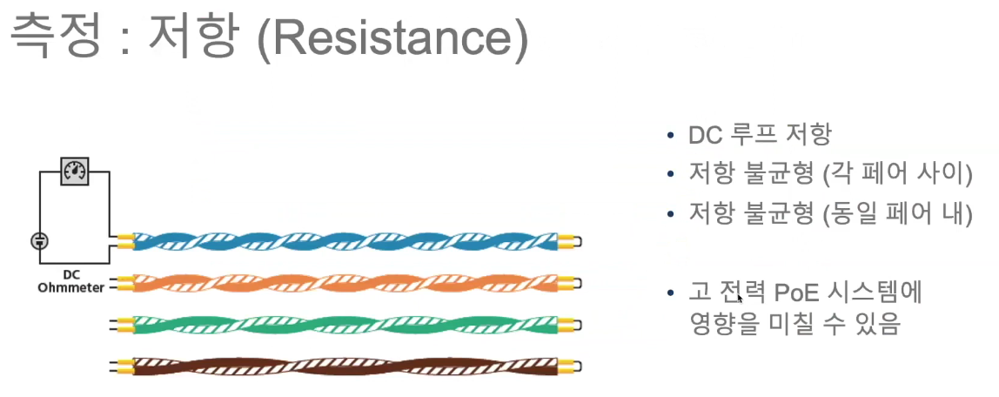

www.allthatcable.com
blog.naver.com/ggunss
blog.naver.com/flukenetworks