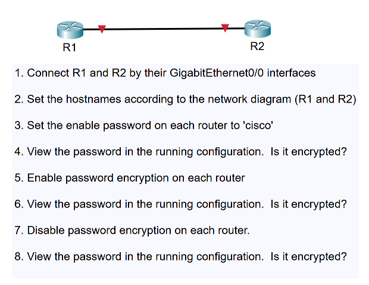

# Packet Tracer Lab - Basic Router Configuration

## 목표
- 두 대의 라우터(R1, R2)를 연결
- Hostname 설정
- Enable Password 설정
- Password Encryption 동작 확인

---

# 1. R1과 R2를 GigabitEthernet0/0으로 연결

### 연결 방식
```
R1 GigabitEthernet0/0
        │
        │ Copper Cross-Over
        │
R2 GigabitEthernet0/0
```

(Packet Tracer에서는 Auto Connect를 사용해도 자동으로 적절한 케이블이 선택됨)

---

# 2. Hostname 설정

## R1

```bash
enable
configure terminal
hostname R1
```

## R2

```bash
enable
configure terminal
hostname R2
```

---

# 3. Enable Password를 'cisco'로 설정

## R1

```bash
enable
configure terminal
enable password cisco
```

## R2

```bash
enable
configure terminal
enable password cisco
```

---

# 4. Running Configuration에서 Password 확인

명령어

```bash
show running-config
```

출력 예시

```bash
enable password cisco
```

### 결과

❌ 암호화되지 않음 (Plain Text)

---

# 5. Password Encryption 활성화

## R1

```bash
configure terminal
service password-encryption
```

## R2

```bash
configure terminal
service password-encryption
```

---

# 6. Running Configuration에서 Password 확인

명령어

```bash
show running-config
```

출력 예시

```bash
enable password 7 0822455D0A16
```

### 결과

✅ 암호화되어 표시됨

> Cisco Type 7 Encryption 방식 사용

---

# 7. Password Encryption 비활성화

## R1

```bash
configure terminal
no service password-encryption
```

## R2

```bash
configure terminal
no service password-encryption
```

---

# 8. Running Configuration에서 Password 확인

명령어

```bash
show running-config
```

출력 예시

```bash
enable password 7 0822455D0A16
```

### 결과

✅ 암호화되어 표시됨
사라지지 않음

> **참고:** 이미 암호화되어 저장된 기존 비밀번호는 `no service password-encryption`만으로 자동 복호화되지 않을 수 있습니다. 평문으로 다시 표시하려면 `enable password cisco`를 다시 입력하여 재설정해야 합니다.

---

# 명령어 요약

| 단계 | 명령어 |
|-------|---------|
| Hostname 설정 | `hostname R1` |
| Enable Password 설정 | `enable password cisco` |
| 설정 확인 | `show running-config` |
| Password Encryption 활성화 | `service password-encryption` |
| Password Encryption 비활성화 | `no service password-encryption` |

---

# 학습 포인트

- `enable password`는 기본적으로 평문(Plain Text)으로 저장된다.
- `service password-encryption`을 활성화하면 Cisco Type 7 방식으로 암호화되어 저장된다.
- `no service password-encryption`은 이후 저장되는 비밀번호에만 영향을 주며, 이미 암호화된 비밀번호는 자동으로 평문으로 복원되지 않는다.
- 보안을 위해 실제 환경에서는 `enable password`보다 **`enable secret`** 사용이 권장된다.