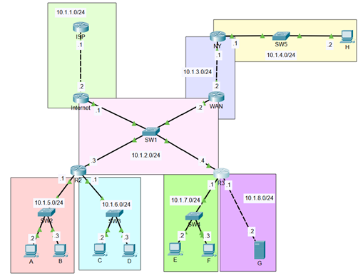
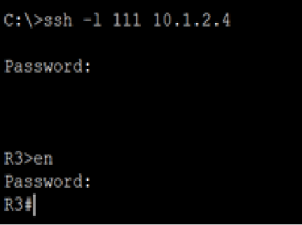
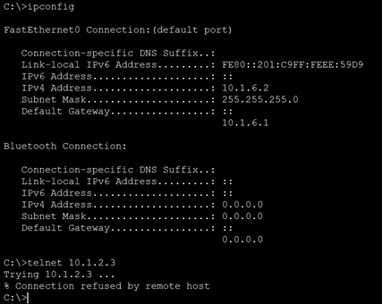
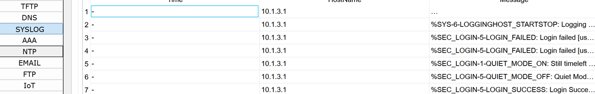
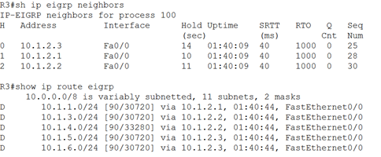

# 🔐 Cisco Enterprise Security Lab

> **Enterprise Network Security Fundamentals using Cisco Packet Tracer**


<p align="center">


</p>

---

# 📖 Overview

이 프로젝트는 **Cisco Packet Tracer** 환경에서 Enterprise 네트워크를 구축하고, Cisco IOS의 기본 보안 기능을 적용한 실습 프로젝트입니다.

라우터 간 **EIGRP 동적 라우팅**을 구성하고, **SSH, Telnet, ACL, Privilege Level, Login Security, Syslog** 등을 적용하여 실제 운영 환경에서 사용되는 보안 기능을 학습하였습니다.

---

# 🎯 Objectives

- Configure EIGRP Dynamic Routing
- Build an Enterprise Network Topology
- Configure SSH Remote Access
- Configure Telnet Authentication
- Apply Standard / Extended ACL
- Configure Login Security
- Configure Syslog Logging
- Configure Privilege Levels
- Secure Cisco IOS Devices

---

# 🖥 Network Topology

<p align="center">

</p>

---

# 📂 Project Structure

```text
04_Cisco_Enterprise_Security_Lab
│
├── README.md
│
├── docs
│   ├── Design.md
│   ├── Addressing.md
│   ├── Security.md
│   ├── Verification.md
│   └── Lessons_Learned.md
│
├── configs
│   ├── ISP.txt
│   ├── Internet.txt
│   ├── WAN.txt
│   ├── NY.txt
│   ├── R2.txt
│   └── R3.txt
│
├── screenshots
│   ├── topology.png
│   ├── eigrp_neighbors.png
│   ├── ping_test.png
│   ├── ssh_login.png
│   ├── telnet_login.png
│   ├── acl_test.png
│   └── syslog.png
│
└── packettracer
    └── Security_Basic_Lab.pkt
```

---

# 📑 Documentation

| Document | Description |
|-----------|-------------|
| 📐 [Design](docs/Design.md) | Network Design |
| 🌐 [Addressing](docs/Addressing.md) | IP Address Plan |
| 🔒 [Security](docs/Security.md) | Security Configuration |
| ✅ [Verification](docs/Verification.md) | Verification Commands |
| 📚 [Lessons Learned](docs/Lessons_Learned.md) | Lessons Learned |
| ⚙️ [Device Configurations](configs/) | Cisco IOS Configurations |

---

# 🌐 Network Addressing

| Network | Purpose |
|----------|----------|
|10.1.1.0/24|ISP|
|10.1.2.0/24|Core Backbone|
|10.1.3.0/24|WAN|
|10.1.4.0/24|NY Branch|
|10.1.5.0/24|LAN-A|
|10.1.6.0/24|LAN-B|
|10.1.7.0/24|LAN-C|
|10.1.8.0/24|Server Network|

---

# 🖥 Device Summary

| Device | Role | Features |
|----------|------|-----------|
|ISP|ISP Router|EIGRP|
|Internet|Core Router|Privilege Levels|
|WAN|WAN Router|Backbone Routing|
|NY|Branch Router|ACL, Login Security, Syslog|
|R2|Distribution Router|Standard ACL, Banner|
|R3|Management Router|SSH v2|

---

# 🔒 Security Features

- ✅ SSH Version 2
- ✅ Local User Authentication
- ✅ Telnet Authentication
- ✅ Login Blocking
- ✅ Login Success / Failure Logging
- ✅ Password Minimum Length
- ✅ Standard ACL
- ✅ Extended ACL
- ✅ Privilege Levels
- ✅ MOTD Banner
- ✅ Remote Syslog
- ✅ Cisco IOS Hardening

---

# 🚀 Technologies

| Category | Technology |
|-----------|------------|
| Simulator | Cisco Packet Tracer |
| Routing | EIGRP |
| Security | ACL |
| Remote Access | SSH v2 / Telnet |
| Authentication | Local User Database |
| Monitoring | Syslog |
| Platform | Cisco IOS |

---

# 📸 Screenshots

|Topology|SSH Login|
|---------|---------|
|||

|Ping Test|ACL Verification|
|---------|----------------|
|||

|Syslog|EIGRP Neighbor|
|------|---------------|
|||

---

# 🧪 Verification

| Test | Result |
|-------|--------|
|EIGRP Neighbor|✅ Success|
|End-to-End Ping|✅ Success|
|SSH Login|✅ Success|
|Telnet Login|✅ Success|
|ACL Verification|✅ Success|
|Syslog Logging|✅ Success|

---

# 🔑 Lab Credentials

> **Note:** The following credentials are used **only for Cisco Packet Tracer lab exercises** and are intentionally included for educational purposes.

### Internet Router

| Level | Password |
|------:|----------|
|5|aaa|
|10|bbb|
|15|ccc|

### NY Router

| Username | Password |
|----------|----------|
|111111|aabb3344|

### R2

| Access | Password |
|---------|----------|
|Enable|test1|
|Console|test3|
|VTY|test2|

### R3

| Item | Value |
|------|-------|
|Username|111|
|Password|222|
|Domain|test.com|
|SSH Version|2|
|RSA Key|1024-bit|
|SSH Timeout|30 Seconds|

---

# 📚 Skills Demonstrated

- Enterprise Network Design
- Cisco IOS Configuration
- Dynamic Routing (EIGRP)
- Router Hardening
- Secure Remote Management
- Access Control Lists (ACL)
- Authentication & Authorization
- Syslog Configuration
- Cisco Device Security
- Network Troubleshooting

---

# 📄 License

This project is intended for educational purposes and is based on Cisco Packet Tracer laboratory exercises.